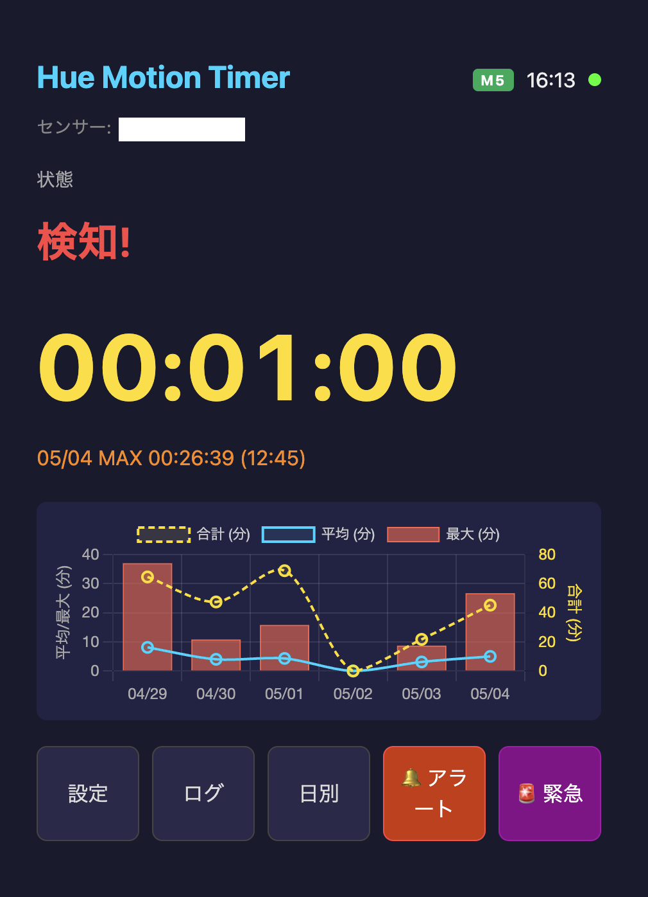

# Hue Motion Timer

Philips Hue 人感センサーを使ったモーション検知経過時間モニター。M5Stack 組み込みデバイス版と Web アプリ版の2つを提供します。

[English version](README.md)

## このプロジェクトの特徴

🌐 **[プロジェクトページ](https://yo1t.github.io/hue-motion-timer/ja.html)** | **[English Page](https://yo1t.github.io/hue-motion-timer/)**

- **リアルタイム経過時間タイマー** — 一般的な ON/OFF 検知とは異なり、最初の検知からの滞在時間をリアルタイムに計測・表示
- **Home Assistant 不要** — Hue Bridge API に直接接続し、追加のハブやプラットフォームなしで動作
- **デュアルインターフェース** — LCD + スピーカー付き M5Stack デバイスと Web ダッシュボードの両方を提供。それぞれ独立動作も連携動作も可能
- **段階的アラート** — 時間経過に応じた通常アラートと緊急アラートを設定可能
- **履歴分析** — 日別統計（平均/最大/最小/合計）のグラフ表示と長期ログ保存
- **ゼロコンフィグセットアップ** — Bridge 自動探索、ボタン押下で API キー取得、画面上でセンサー選択まで自動化

## 概要

### Web ダッシュボード


*日本語の画面です。設定で `lang` を `"en"` にすれば英語で表示されます。*

Hue モーションセンサー (ZLLPresence) を監視し、最後の検知からの経過時間をリアルタイム表示します。滞在時間の追跡、アラート、履歴ログ機能を備えています。

## ユースケース

- **施設管理** — 会議室・休憩室の実利用時間を計測して稼働率を分析。利用頻度データに基づいた清掃タイミングの最適化。

- **健康管理** — トイレの頻度と滞在時間を日別に記録し、生活リズムの変化を可視化。デスクワークの連続時間を計測して座りすぎ防止。

- **介護** — 深夜の徘徊を廊下・玄関のセンサーで検知。日常の行動パターンの変化を統計データで早期に把握。

- **見守り・安全** — 浴室やトイレの異常な長時間滞在を検知してアラート。一人暮らしの高齢者や子供の安否確認。

- **ペット** — 留守番中の活動パターンを部屋ごとに記録。普段と違う場所への長時間滞在で異常行動を検知。

## 2つのバージョン

### M5Stack 版 (`hue_motion_timer/`)
LCD ディスプレイとスピーカーを備えたスタンドアロン組み込みデバイス。

### Web 版 (`hue_motion_web/`)
Node.js + Apache リバースプロキシで動作するブラウザベースのダッシュボード。

両バージョンは同じ Hue Bridge を共有し、同時に動作可能です。それぞれ独立して動作します — M5Stack 版は Web サーバーなしで単体動作し、Web 版も M5Stack なしで単体動作します。両方を同時に動かすと、Web 版から M5Stack のアラートをリモートで鳴らすこともできます。

## 機能一覧

| 機能 | M5Stack | Web |
|------|---------|-----|
| リアルタイムタイマー表示 | ✓ | ✓ |
| 複数センサー対応 | — | ✓ (最大20) |
| センサー概要バー | — | ✓ |
| 時間帯別グラフ (日別) | — | ✓ |
| センサーごとのアラート設定 | — | ✓ |
| モーション検知ステータス | ✓ | ✓ |
| Bridge 自動探索 (mDNS/Cloud) | ✓ | ✓ (IP レンジスキャン) |
| API キー自動取得 | ✓ | ✓ |
| センサー選択 UI | ✓ | ✓ |
| 日本語 UI | ✓ | ✓ |
| アラート | ✓ (スピーカー) | ✓ (Web Audio) |
| 緊急アラート | ✓ | ✓ |
| リモートアラート (Web → M5Stack) | ✓ | ✓ |
| 未検知3分で自動リセット | ✓ | ✓ |
| ログ履歴 | 20件 (NVS) | 1000件 (JSON) |
| 日別統計 | 10日分 (NVS) | 2年分 (JSON) |
| 日別グラフ (平均/最大/合計) | — | ✓ (Chart.js) |
| 時計・バッテリー表示 | ✓ | ✓ (時計のみ) |
| 再起動後のタイマー復元 | ✓ (1分以内) | ✓ (1分以内) |
| WiFi 自動再接続 | ✓ | — |
| M5Stack オンライン状態表示 | — | ✓ |
| IP ホワイトリスト | — | ✓ |

## M5Stack 版

### ハードウェア要件

- **M5Stack Basic** (ESP32、320x240 LCD、1W スピーカー、内蔵バッテリー)
  - CPU: ESP32-D0WDQ6-V3 (デュアルコア 240MHz)
  - Flash: 16MB
  - RAM: 520KB SRAM
  - ディスプレイ: 320x240 IPS LCD
  - スピーカー: 1W (NS4168 DAC)
  - バッテリー: 150mAh (USB/バッテリー自動切替)
  - ボタン: 物理ボタン3つ (A/B/C)
- **Philips Hue Bridge** (V1 または V2、HTTPS 対応)
  - V1 (BSB001): HTTP/HTTPS 対応、丸型
  - V2 (BSB002/BSB003): HTTPS のみ、角型
  - M5Stack と同一ネットワーク上に必要 (Web 版はルーティング経由でも可)
  - API バージョン 1.x (CLIP v1) を使用
- **Philips Hue 人感センサー** (ZLLPresence タイプ)
  - 屋内用: SML001, SML002
  - 屋外用: SML003, SML004
  - 事前に Hue アプリで Bridge とペアリングしておく必要があります
- **USB 電源** (5V/1A 以上推奨)

### ソフトウェア要件

- [Arduino CLI](https://arduino.github.io/arduino-cli/) または Arduino IDE
- ボード: `m5stack:esp32:m5stack_core`
- パーティション: `huge_app` (日本語フォントに必要、3MB アプリ領域)

### ライブラリ

- M5Unified
- ArduinoJson (v7)
- WiFi, HTTPClient, WiFiClientSecure, Preferences, ESPmDNS (ESP32 標準)

### セットアップ

1. 設定ファイルのテンプレートをコピー:
   ```bash
   cp hue_motion_timer/config.h.ja.example hue_motion_timer/config.h
   # 英語コメント版: cp hue_motion_timer/config.h.example hue_motion_timer/config.h
   ```

2. `config.h` に WiFi 情報を記入。Hue の設定は空欄のままで自動セットアップ可能:
   ```c
   #define WIFI_SSID "あなたのSSID"
   #define WIFI_PASS "あなたのパスワード"
   #define HUE_BRIDGE_IP   ""
   #define HUE_API_KEY     ""
   #define HUE_SENSOR_NAME ""
   #define POLL_INTERVAL   2000
   #define RESET_TIMEOUT   180000
   #define SPEAKER_VOLUME  200
   #define UI_LANG 0
   #define WEB_SERVER_URL  ""
   #define DEFAULT_URGENT_MINUTE 20
   #define ALERT_MIN_1  15
   #define ALERT_MIN_2  20
   #define ALERT_MIN_3  30
   #define ALERT_MIN_4  45
   #define ALERT_MIN_5  60
   ```

3. コンパイルと書き込み:
   ```bash
   arduino-cli compile --fqbn "m5stack:esp32:m5stack_core:PartitionScheme=huge_app" hue_motion_timer/
   arduino-cli upload --fqbn "m5stack:esp32:m5stack_core:PartitionScheme=huge_app" --port /dev/cu.usbserial-XXXXX hue_motion_timer/
   ```

4. 初回起動時は画面の指示に従ってください:
   - Bridge は自動的に探索されます (mDNS → Cloud フォールバック)
   - 画面の指示に従い Hue Bridge のボタンを押すと API キーが自動取得されます
   - ボタン A/B/C で人感センサーを選択します

### ボタン操作

| ボタン | メイン画面 | ログ画面 | 設定画面 |
|--------|-----------|---------|---------|
| A (左) | 設定 | 前ページ | WiFi 再設定 / アラーム試聴 |
| B (中央) | ログ表示 | 日別統計 | 戻る |
| C (右) | 手動更新 | 次ページ | Hue Bridge 再設定 |

### アラートスケジュール

設定可能な間隔（デフォルト: 15, 20, 30, 45, 60分）でアラートメロディを再生します。アラート時間は `config.h` の `ALERT_MIN_1` 〜 `ALERT_MIN_5` で設定します（`0` で個別に無効化可能）。緊急アラート分数（デフォルト: 20分、`DEFAULT_URGENT_MINUTE` で設定）では緊急アラート音がメロディの前に鳴ります。`urgentMinute` を `0` または `ALERT_MIN` のどれにも一致しない値に設定すると、通常アラートはそのままで緊急アラートのみ無効化できます。

## Web 版

### サーバー要件

- **Node.js** 18 以上 (Amazon Linux 2023 で動作確認済み)
- **Apache** 2.4 以上 + `mod_proxy` / `mod_proxy_http` (リバースプロキシ用)
- Hue Bridge へのネットワークアクセス (同一 LAN またはルーティング経由)

### 依存ライブラリ

- express (v4)
- Chart.js (v4、CDN 経由で読み込み)

### セットアップ

1. 設定ファイルのコピーとインストール:
   ```bash
   cd hue_motion_web
   cp config.json.example config.json
   npm install
   ```

2. `config.json` を編集:
   ```json
   {
     "bridgeIP": "",
     "apiKey": "",
     "port": 3000,
     "pollInterval": 2000,
     "resetTimeout": 180000,
     "sensors": [],
     "authUser": "admin",
     "authPass": "",
     "allowedNetworks": ["192.168.1.0/24", "10.0.0.0/8", "127.0.0.1/32"],
     "lang": "ja"
   }
   ```

3. Apache リバースプロキシの設定 (`/etc/httpd/conf.d/hue-motion.conf`):
   ```apache
   ProxyPass /hue http://localhost:3000/hue
   ProxyPassReverse /hue http://localhost:3000/hue
   ```

4. systemd サービスの設定:
   ```ini
   [Unit]
   Description=Hue Motion Timer Web
   After=network.target

   [Service]
   Type=simple
   User=ec2-user
   WorkingDirectory=/home/ec2-user/hue_motion_web
   ExecStart=/usr/bin/node server.js
   Restart=always
   RestartSec=5

   [Install]
   WantedBy=multi-user.target
   ```

5. 起動と有効化:
   ```bash
   sudo systemctl enable hue-motion
   sudo systemctl start hue-motion
   ```

6. `http://your-server/hue/` にアクセスし、設定画面から初期設定を行います。

### セキュリティ

- **IP ホワイトリスト**: CIDR 形式で許可ネットワークを設定可能
- **Basic 認証**: オプション、config.json の `authUser`/`authPass` で設定
- **セキュリティヘッダー**: CSP, X-Content-Type-Options, X-Frame-Options, Referrer-Policy
- **レート制限**: IP あたり 120 リクエスト/分
- **入力バリデーション**: Bridge IP はプライベート IP のみ、センサー名は100文字以内
- **localhost バインド**: Node.js は 127.0.0.1 のみリッスン (Apache 経由でアクセス)
- **認証情報の非公開**: API キーは設定 API でマスク表示

### M5Stack 連携

M5Stack の `config.h` で `WEB_SERVER_URL` を設定すると以下が有効になります:
- Web UI からのリモートアラート送信
- 緊急アラート分数の Web からの動的変更
- Web ダッシュボードでの M5Stack オンライン状態表示

## ファイル構成

```
├── hue_motion_timer/          # M5Stack 版
│   ├── hue_motion_timer.ino   # メインスケッチ
│   ├── lang_ja.h              # 日本語 UI 文字列
│   ├── lang_en.h              # 英語 UI 文字列
│   ├── config.h               # 設定ファイル (git 除外)
│   ├── config.h.example       # テンプレート (英語)
│   └── config.h.ja.example    # テンプレート (日本語)
├── hue_motion_web/            # Web 版
│   ├── server.js              # Node.js バックエンド
│   ├── config.json            # 設定ファイル (git 除外)
│   ├── config.json.example    # テンプレート
│   ├── state.json             # 永続化データ (git 除外)
│   ├── package.json
│   └── public/
│       ├── index.html
│       ├── app.js
│       └── style.css
├── .gitignore
├── README.md                  # 英語版
└── README.ja.md               # 日本語版
```

## ライセンス

MIT
